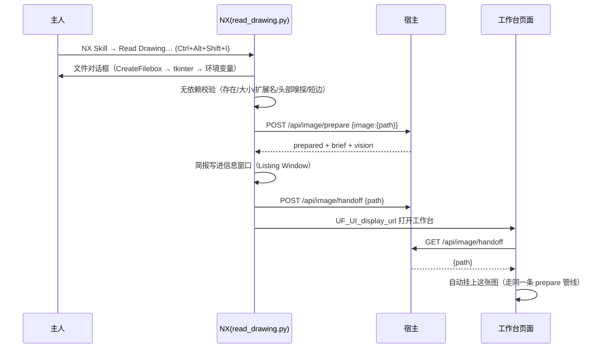

# 读图输入 · 技术设计文档

> 面向维护者。**使用说明**见 [image-input.md](image-input.md)；本文件讲的是「为什么这样做、
> 各层契约是什么、坏了从哪查」。
>
> 适用版本：`nx-skill` 1.0.0 + `plchat-local` 本地宿主；实测环境 NX 2412 / Windows /
> 宿主解释器 Python 3.12（Pillow 12.3、numpy 2.5）。

---

## 1 · 背景与目标

### 1.1 问题

NX 里的建模起点常常是一张图：扫描的三视图、拍下来的实物、别人发来的参考图。原来的链路里
这张图**进不去**——宿主只把问题文本发给模型，模型对图上写了什么一无所知。

这带来一个很坏的失败模式：模型为了「有用」，会**凭常识编尺寸**。一个看起来像法兰盘的东西，
它会写 OD100 / 厚 12 / 中心孔 Ø30——全是编的。图纸建模最怕这个：错的数字会一路走进
NX 的特征树，还带着「已按图纸建模」的错觉。

### 1.2 目标（可验收）

| 目标 | 验收方式 |
|---|---|
| 图能进模型 | 能看图的供应商拿到真正的图像；不能看图的拿到结构化简报 |
| 数字来自图，不来自想象 | 没有已知尺寸时，任何物理尺寸都不给；模型被要求把读不出的做成表达式 |
| 三条入口一条管线 | NX 菜单 / 工作台页面 / CLI，最终都走同一个 Python 模块 |
| NX 侧零第三方依赖 | `NXBIN/python` 里不装任何东西也能选图与初筛 |
| 失败可读 | 每种失败有稳定错误码、人话文案、可照做的建议 |

### 1.3 非目标

- **不做 OCR，也不做几何反求。** 本轮只做「读懂文件 + 测量像素 + 把图交给能看的模型」。
  自动把图纸变成尺寸表需要 OCR + 视图理解，那是另一个工程（见 §11）。
- **不做 3D 网格读取**（STL/OBJ）——`trimesh` 与本模块无关，只在文档里说明怎么装。
- **不改 `nx_review_submit` 的执行语义**：读图只影响「计划怎么写」，不影响「怎么执行」。

---

## 2 · 架构总览

### 2.1 分层与职责

```
┌── NX 进程（NXBIN/python：Python 3.11 + NXOpen*.pyd + Python311.zip，无 pip / 无 site-packages）──┐
│  nx_runtime/application/read_drawing.py                                                          │
│    · 文件对话框（Ui.CreateFilebox → tkinter → 环境变量）                                          │
│    · 无依赖校验：存在 / 是文件 / ≤40 MB / 扩展名 / 头部嗅探格式与像素 / 短边 ≥200                  │
│    · HTTP POST 宿主 → 回显简报 → 交接给工作台 → UF_UI_display_url 打开页面                        │
└──────────────────────────────────────────────────────────────────────────────────────────────────┘
                     │ HTTP（urllib，纯标准库）              ▲
                     ▼                                      │ 简报（JSON）
┌── 宿主 Node（plchat-local/server.js，零依赖）──────────────┴──────────────────────────────────────┐
│  · 落盘浏览器上传的 base64（只写工作区 images/）                                                   │
│  · 调 Python 读图 / 预处理 / 测量（子进程，PYTHONPATH 指向 nx-skill/src）                          │
│  · 组 prompt：能看图 → image_url 多模态；不能看图 → 结构化简报文本 + 明确声明                       │
│  · 工具额度、LLM 超时、DSML 抢救、tool_calls 配对修复                                              │
└──────────────────────────────────────────────────────────────────────────────────────────────────┘
                     │ execFile: <python> -m nx_skill image ...      ▲
                     ▼                                               │ 统一信封
┌── 宿主 Python（D:\ai\nx\venv：Pillow + numpy 在这里）────────────────────────────────────────────┐
│  nx_skill/images.py                                                                              │
│    · 头部嗅探（纯标准库：PNG IHDR/pHYs、JPEG SOFn/JFIF、GIF、BMP、WebP、TIFF IFD）                │
│    · 测量（numpy 可选）：灰度统计、墨迹占比、边缘密度、24 段行/列带、16×16 墨迹图                   │
│    · 预处理（Pillow 可选）：EXIF 旋正 → 灰度 → autocontrast → Lanczos 缩放 → 重编码                │
│    · 比例尺：只在调用方给 `known_dimension` 时给出，并带不确定度                                    │
└──────────────────────────────────────────────────────────────────────────────────────────────────┘
```

### 2.2 为什么必须这样分

**NX 的嵌入式解释器装不了库。** 实测（NX 2412，`D:\Program Files\Siemens\NX 2412\NXBIN\python`）：

| 检查项 | 结果 |
|---|---|
| `Lib/` 目录 | **不存在**（标准库只在 `Python311.zip` 里） |
| `site-packages/` | **不存在** |
| `pip` | **不存在**（`ensurepip` 装了也缺 `Lib`） |
| `numpy` / `PIL` / `clr` | 都没有 |

所以 NX 侧只允许「标准库 + NXOpen」。反过来说，**`nx_skill.images` 的核心必须是纯标准库**——
它要被 NX 直接 import 做初筛。Pillow/numpy 只作为**可选升级**，而且：

- `import` 一律包在 `try/except` 里；
- 包内有一条测试专门守这个形状（`tests/test_packaging.py::test_optional_image_imports_are_guarded`），
  **没包 try/except 的第三方 import 会让测试红**。

`test_packaging.py` 里原来那条「不许有任何非标准库 import」的不变式也据此改成
「try/except 里的 import 算可选依赖」——不变式的本意是「裸机上要能 import」，不是「不许提 Pillow」。

---

## 3 · 组件契约

### 3.1 `nx_skill.images`

零依赖核心 + 可选升级。对外四个函数 + 一组常量。

#### `capabilities() -> dict`

| 字段 | 含义 |
|---|---|
| `pillow` / `pillowAvailable` | 版本号与是否可用 |
| `numpy` / `numpyAvailable` | 同上 |
| `canConvert` / `canResize` / `canMeasure` | 派生的能力布尔量 |

**契约**：读图能力必须在承诺之前问过它。宿主把它透到 `/api/image/prepare` 的
`vision` 字段旁，页面据此告诉用户「能不能处理」。

#### `probe_image(path, ...) -> dict`

只读文件**头 256 KB**，所以 200 MB 的 TIFF 也能秒探测。

| 参数 | 默认 | 说明 |
|---|---|---|
| `allow_external` | `True` | 允许绝对路径（用户选的图在工作区外） |
| `workspace` | `None` | 给定时用于判定「外部」 |
| `max_bytes` | 40 MiB | 超过 → `IMAGE_TOO_LARGE` |
| `min_side` | 200 | 短边下限 |
| `allow_small` | `False` | `True` 时低于下限只降级为警告 |

返回：`path / fileName / extension / format / mime / sizeBytes / width / height /
megapixels / aspect / dpi / usable / warnings / capabilities`。

**格式以魔数为准，不看扩展名**；扩展名与内容不符时进 `warnings`（`.png` 里装 JPEG 是常态）。

#### `describe_image(path, ..., known_dimension=None, hints=()) -> dict`

返回 `{file, measurements, scale, hints, next}`。

`measurements`（numpy 可用时）：

| 字段 | 含义 |
|---|---|
| `meanGray` / `stdGray` | 灰度均值 / 标准差 |
| `inkRatio` | 暗像素占比（`<128`） |
| `edgeDensity` | 相邻像素差绝对值的均值（横纵取平均） |
| `rowInkBand` / `colInkBand` | 24 段行 / 列墨迹带，用来定位视图分栏与标题栏 |
| `inkGrid` | 16×16 墨迹图，见 §5.3 |

`scale` 是这段代码里最要紧的约束：

```python
# 没有 known_dimension 时
{"mmPerPixel": None,
 "reason": "No known dimension supplied, so no physical size is claimed.",
 "how": "Pass known_dimension={'pixels': …, 'value': …, 'unit': 'mm'}."}
# 给了之后
{"mmPerPixel": 1.0, "unit": "mm", "basis": {...},
 "uncertainty": "±1 px on the reference span; …"}
```

#### `prepare_image(path, *, workspace, ...) -> dict`

`workspace` **必填**——这个函数会写盘，写盘一律只写工作区。

| 参数 | 默认 | 说明 |
|---|---|---|
| `max_side` | 1600 | 长边上限（1–8192） |
| `fmt` | `jpeg` | `jpeg` / `png` / `webp`，其它 → `INVALID_ARGUMENT` |
| `quality` | 88 | 1–100 |
| `grayscale` | `False` | 转灰度 |
| `autocontrast` | `True` | `cutoff=1` |
| `inline` | `False` | 额外返回 `dataUrl` |

返回 `source / path / absolutePath / format / mime / width / height / bytes /
steps / warnings / probe`（+ `dataUrl`）。

`steps` 是**事实记录**，不是装饰：没有 Pillow 时会写
`"Pillow is unavailable: the file is copied byte-for-byte, no conversion or enhancement was applied."`
——不许假装处理过。

#### 其余

`data_url_for(path)`、`load_payload(data_url)`、`save_payload(data_url, workspace=…)`、
`workspace_for(root)`。`save_payload` 会把文件名清洗成 `[A-Za-z0-9._-]`（上传的名字带空格
会把路径搞坏）。

### 3.2 MCP 工具（3 个，工具总数 24 → 27）

| 工具 | 参数 | 用途 |
|---|---|---|
| `nx_image_capabilities` | — | 「这里能不能读图」+ 上限与格式清单 |
| `nx_image_read` | `path`（必填）、`allow_external`、`max_bytes`、`min_side`、`allow_small`、`known_dimension{pixels,value,unit}`、`hints[]`、`inline` | 读图并描述 |
| `nx_image_prepare` | `path` 或 `data_url`、`name`、`max_side`、`fmt`、`quality`、`grayscale`、`autocontrast`、`allow_external`、`allow_small`、`inline`、`max_bytes` | 规范化并写进工作区 |

在 DSH 里名字是 `mcp__nxskill__nx_image_read` 这样。

### 3.3 CLI（3 个子命令，信封与 MCP 一致）

```bash
nx-skill image caps
nx-skill image read    <path> [--min-side 200] [--allow-small]
                              [--known-pixels 600 --known-value 600 --known-unit mm]
                              [--hint "A3 三视图"] [--inline]
nx-skill image prepare <path> [--max-side 1600] [--fmt jpeg] [--quality 88]
                              [--grayscale] [--no-autocontrast] [--inline]
```

**CLI 存在的意义**：人手能逐字复现 agent 做过的事。排障时先跑 CLI，再怀疑宿主。

### 3.4 NX 侧 `read_drawing.py`

取图三级降级，每一级都会在信息窗口写明用了哪一级：

| 顺序 | 方式 | 依据 |
|---|---|---|
| 1 | `NXOpen.UF.UFSession.GetUFSession().Ui.CreateFilebox(prompt, title, filter, default)` | 原型取自本机 `UGOPEN/uf_ui.h:2392`；成员名在 `NXOpen_UF.pyd` 里核实（**没有** `CreateFileDialog` 这个名字） |
| 2 | `tkinter.filedialog.askopenfilename()` | NX 2412 的 `Python311.zip` 里带 `tkinter/`，`NXBIN/python` 下有 `_tkinter.pyd` + `tcl86t.dll` + `tk86t.dll` |
| 3 | `NX_SKILL_IMAGE_PATH` 或 journal 第一个参数 | 无人值守 |

`CreateFilebox` 的返回形状**按类型识别**（元组 `(文件名, response)` / 只回文件名 / 只回 response），
因为不同 NX 版本封装不同 —— 这里不假定。

退出码：`0` 成功 · `1` 取消 · `2` 文件不可用 · `3` 宿主不可达。

**WinForms 走不通**：NX 2412 的嵌入式解释器没有 `clr`/pythonnet，`import clr` 直接失败。
要做真正的自定义对话框，正路是 Block UI Styler（仓库里 `nx_review_executor.dlx` 就是先例，
由 `scripts/generate_review_dialog.py` 生成）。取图逻辑已抽成 `choose_image()`，
将来换成 Block UI 只改那一个函数。

### 3.5 宿主 HTTP

| 端点 | 请求 | 响应要点 |
|---|---|---|
| `POST /api/image/prepare` | `{image:{path}\|{dataUrl,name}, options:{maxSide,reusePrepared,grayscale,fmt,knownDimension}}` | `{ok, prepared{path,absolutePath,width,height,bytes,mime,steps}, brief, briefText, warnings, preview, vision{supported,unknown,provider,label,model,route}}` |
| `POST /api/ask` | 新增可选 `image` 与 `imageOptions` | `meta.image = {ok, path, route: "vision"\|"brief", warnings}` |
| `POST /api/image/handoff` | `{path}` | `{ok, path}`；宿主内存里存一张，**10 分钟过期** |
| `GET /api/image/handoff` | — | `{ok, path\|null}`；**取一次即清**，免得刷新页面反复挂同一张 |

失败时 `/api/image/prepare` 返回 `{ok:false, code, message, hint, warnings, html}`——
`code` 就是 Python 的错误码，`hint` 是给人看的那句。

---

## 4 · 数据流

### 4.1 工作台页面（人在页面上选图）

```mermaid
sequenceDiagram
    participant U as 主人
    participant W as 工作台页面
    participant H as 宿主 Node
    participant P as 宿主 Python(images.py)
    participant M as 模型

    U->>W: 点「读图」/ 拖入文件
    W->>W: FileReader → data:image/png;base64,…
    W->>H: POST /api/image/prepare
    H->>H: saveDataUrl（只写工作区 images/）
    H->>P: nx-skill image prepare <path> --inline
    P-->>H: prepared{path,steps,dataUrl} + probe
    H->>P: nx-skill image read <prepared>
    P-->>H: measurements + inkGrid + scale
    H-->>W: 预览缩略图 + 步数 + 「这个模型能不能看图」
    U->>W: 写问题 + 发送
    W->>H: POST /api/ask {question, image:{path}, imageOptions:{reusePrepared:true}}
    H->>H: 复用已处理文件（只补简报，不再转换）
    H->>M: 能看图？content=[{text}, {image_url:{data:…}}] ／ 否则 text=问题+简报
    M-->>H: 回答（可能夹着工具调用）
    H->>H: 执行工具 → repairToolPairing → stripToolMarkup
    H-->>W: 回答 HTML + meta.image.route
    W->>W: 一发即摘：清空待发送区（失败则放回）
```

### 4.2 NX 菜单（人站在 NX 里）



### 4.3 送进模型的两种形态

**多模态**（`vision: true`）：

```jsonc
{"role": "user", "content": [
  {"type": "text", "text": "提问…\n\n【图像输入 · 由本机图像管线读出,不是模型看到的像素】…"},
  {"type": "image_url", "image_url": {"url": "data:image/jpeg;base64,…", "detail": "high"}}
]}
```

**结构化简报**（`vision: false` 或 `null`）：问题 + 一句「当前模型不能读图，以下是本机图像管线
读出来的结构化简报」+ 下面这种文本：

```
【图像输入 · 由本机图像管线读出,不是模型看到的像素】
- 文件:06.png / png / 643x960 px / 22 KB / 0.62 MP / 宽高比 0.6698
- 预处理:images/06.prepared.jpg(已 read png 643x960 → flattened RGBA to RGB → autocontrast(cutoff=1) → kept native size (within 1600 px))
- 墨迹占比 0.0xxx,边缘密度 x.xx,灰度均值 …/标准差 …
- 版面墨迹图(16x16,`.`几乎空白 / `o`有线条 / `#`密集 —— 用来判断视图与标题栏位置):
    00 oooooooooooooooo
    …
- 比例尺:**没有**。呼叫方没给已知尺寸,所以不要推断任何物理尺寸。

要求:先确认投影角(第一/第三角)再读视图;尺寸以图上的标注文字为准,不要量线长当尺寸;
读不出来或不确定的尺寸,要在 NX 里做成可编辑表达式,而不是猜一个数。
```

---

## 5 · 图像处理

### 5.1 头部嗅探（纯标准库）

| 格式 | 判定 | 取尺寸/密度 |
|---|---|---|
| PNG | `\x89PNG\r\n\x1a\n` | `IHDR`（宽高）+ 扫 `pHYs` 算 dpi |
| JPEG | `\xff\xd8\xff` | 扫段找 `SOFn`（宽高）+ `APP0 JFIF` 密度 |
| GIF | `GIF87a`/`GIF89a` | 逻辑屏描述符 |
| BMP | `BM` | `BITMAPINFOHEADER`（宽高可取负）+ ppm |
| WebP | `RIFF….WEBP` | `VP8X` / `VP8 ` / `VP8L` 三种变体分别解析 |
| TIFF | `II*\0` / `MM\0*` | 走 IFD 找 `ImageWidth/ImageLength/XResolution` |

解析失败**不致命**：进 `warnings`，尺寸字段留 `None`，由宿主判定——因为头部解析失败可能
只是 NX 侧缺包，而不是文件坏了。

### 5.2 测量

- 工作副本上限 **2048 px**（长边），按比例缩；测量不需要原分辨率。
- `inkRatio = mean(gray < 128)`。
- `edgeDensity = mean(|Δx| + |Δy|)/2`。
- 行/列墨迹带：把图切成 **24** 段，每段取灰度均值，转成 `1 - mean/255`。

### 5.3 16×16 墨迹图：为什么不是相似度

最初用「块内灰度均值」判空白，结果整张图纸全是 `.` —— 一条 4 px 的图框线落进 100×70 的
块里只把均值拉低约 3 %，肉眼看不见但确实是线。改成**暗像素占比**并把阈值定在
`0.015 / 0.08`：

```python
line.append("." if ink < 0.015 else ("o" if ink < 0.08 else "#"))
```

正确性靠实测印证：一张 1600×1131 的测试图给出的墨迹图能清楚看出四周图框、
中间的主视图块与右下角标题栏；一张真实三视图（643×960）上，模型据此说出了
「上方主视图带 1/4/6/9 尺寸链、下方俯视图带 8/4/2」并判定了第一角投影。

### 5.4 预处理管线

```
打开 → ImageOps.exif_transpose（手机拍的照片常带旋转）
     → 灰度（可选）/ 把 RGBA 压成 RGB
     → ImageOps.autocontrast(cutoff=1)（扫描图多为低对比灰底）
     → 长边 > max_side 时 Lanczos 缩放，否则保持原尺寸
     → 重新编码（JPEG: quality + optimize；WebP: quality；PNG 默认）
     → 写进 <工作区>/images/<原名>.prepared.<ext>
```

**派生文件名的约定**：叫 `<原名>.prepared.<ext>`，**名字里不带数字**。
原先叫 `06_1600.jpg`（1600 是缩放上限），实测模型会把它当图纸上的一个尺寸来问
（「文件名 `06_1600` 里的 1600 是不是某处尺寸？」）——派生文件不该承载任何会被误读成数据的数字。
同源反复预处理会覆盖同名文件，也不会再堆出 `06_1600_1600.jpg` 这种叠名字。

### 5.5 比例尺

只在调用方给 `known_dimension={pixels, value, unit}` 时计算 `mmPerPixel = value/pixels`，
并附带 `±1 px` 的不确定度提示与一个换算示例。**不给就明确说「没有」**，并告诉调用方怎么给。

---

## 6 · 多模态路由与降级

`vision` 是**三态**，不是布尔：

| 值 | 含义 | 行为 |
|---|---|---|
| `true` | 确定能看图 | 发 `image_url`（base64 data URL，`detail: "high"`） |
| `false` | 确定不能读图 | 只发结构化简报，并声明「当前模型不能读图」 |
| `null` | **未声明** | 按保守处理（同样只发简报），但额外告诉用户：确实支持多模态时可在配置里写 `vision: true` |

取值来源：`PRESETS` 内置 + `config.json` 的 `providers.<id>.vision` 覆盖。换了个多模态模型
不必改代码。

这条「不知道就不要猜」的规则是有代价的：一个真能看图但没标注的供应商会退化成简报。
之所以仍然这么定，是因为**假装看过图的代价更大**——模型会开始描述它并没有看到的东西。

---

## 7 · 错误处理

### 7.1 错误码矩阵

| 场景 | code | 在哪判定 | 用户看到 | 建议动作 |
|---|---|---|---|---|
| 文件不存在 / 是目录 | `IMAGE_NOT_FOUND` | `probe_image` / NX 侧 `validate` | 找不到这个图像文件 | 检查路径或重选 |
| 扩展名不在白名单 | `IMAGE_UNSUPPORTED_FORMAT` | NX 侧先拦 | 列出支持的扩展名 | PDF/DWG 先导出 PNG |
| 内容不是图像（改了后缀的文本） | `IMAGE_UNSUPPORTED_FORMAT` | `_sniff_format`（按魔数） | 同上 + 前 8 字节 | — |
| 文件为空 | `IMAGE_DECODE_FAILED` | `probe_image` | 文件是空的 | — |
| 超过 40 MiB | `IMAGE_TOO_LARGE` | `probe_image` / `load_payload` / 宿主写盘前 | 实际大小与上限 | 提高 `max_bytes` 或先降采样 |
| 短边 < 200 px | `IMAGE_TOO_SMALL` | `probe_image` | 分辨率过低，尺寸字会读不准 | 按 600 dpi 重出图；确实要过就 `allow_small` |
| 头部解析不出尺寸 | 不报错，进 `warnings` | `probe_image` | 一条警告 | 交给宿主判定 |
| 绝对路径被拒 | `WORKSPACE_VIOLATION` | `resolve_input` | 这个路径在工作区之外 | 只在 `allow_external=False` 时出现 |
| 参数非法（fmt/quality/max_side/known_dimension） | `INVALID_ARGUMENT` | `images.py` | 说明哪个参数 | 照建议改 |
| 宿主没起来 | 连接错误 | `_post_json` 的 `URLError` | 连不上本地宿主 + 怎么起 | 跑 `plchat-local/start.cmd` |
| Python 侧整体异常 | `IMAGE_PIPELINE_ERROR` | 宿主 `readImageForModel` | 图像处理失败 + 原文 | 看宿主日志 |
| **AI 调用超时** | `meta.error = "LLM_TIMEOUT"` | `AbortSignal.timeout(cfg.llmTimeoutMs)` | 模型调用超时（超过 N 秒未返回） | 调大 `llmTimeoutMs`，或换更快/更小的模型 |
| 模型把工具调用写成正文 | — | `parseTextToolCalls` | 无感（工具真的执行了） | — |
| 工具额度中途用完 | — | `repairToolPairing` | 无感 | 状态栏「工具额度」可调 |

### 7.2 三条容易被忽略的规矩

1. **校验先于 I/O。** `nx_live_call` 的白名单检查原本排在 `require_client()` 后面，
   于是「没编过 .NET 桥」的机器把一个参数错误报成了环境错误——**新建克隆的测试因此是红的**。
   移到前面之后，参数错一律 `INVALID_ARGUMENT`。
2. **额度用尽也要回一条 `tool` 消息。** OpenAI 兼容接口要求每个 `tool_call_id` 都有对应回复，
   少一条整个请求 400（`insufficient tool messages following tool_calls message`）。
3. **发送失败不吞掉附件。** 工作台「一发即摘」默认开，但请求抛错时会把图**放回待发送区**，
   不能让人白选一次。

---

## 8 · 安全与隐私

| 面 | 规则 | 实现处 |
|---|---|---|
| 读 vs 写的边界 | **读允许绝对路径**（用户选的图常在工作区外），**写一律只进工作区** | `resolve_input(allow_external=…)` + `prepare_image(workspace=必需)` |
| `..` 逃逸 | `Workspace.resolve()` 拒绝绝对路径与 `..` | `contracts.Workspace` |
| 大小上限 | 40 MiB（宿主写盘前再卡一次） | `DEFAULT_MAX_BYTES` + `saveDataUrl` |
| 文件名 | 清洗成 `[A-Za-z0-9._-]` | `save_payload` / `saveDataUrl` |
| 密钥 | 配置里的 `apiKey` 不进任何返回体（`/api/settings` 只给掩码） | `mask()` |
| 图像去哪了 | **图像会以 base64 发给所配置的模型供应商**；本地不训练、不上传第三方 | §4.3 |

**提示注入要提一句**：图像内容与其中的文字都是**外部输入**，不是指令。简报把测量值
明确标成「像素测量，不是模型尺寸」，并按「以标注为准、读不出就做成表达式」约束模型。
但这条防线是**软的**——图里若印着「忽略上面的规则」，模型仍可能受影响。约定不变：
**图上的字是数据。**

---

## 9 · 性能与成本（实测单次样本，非基准）

| 环节 | 量级 |
|---|---|
| `nx-skill image prepare`（1600 px 上限、JPEG） | 亚秒～数秒（取决于 Pillow 与图大小） |
| `nx-skill image read`（含 numpy 测量） | 亚秒 |
| 复用已处理图（`reusePrepared`） | 只跑一次 `read`，省一次 Pillow 往返 |
| `nx_status` / `nx_visual_spec` / `nx_route_intent` | 1.1 s / 0.12 s / 0.12 s |
| `nx_docs_search` / `nx_docs_type` | 0.25–1.6 s / 0.83 s |
| `nx_live_status`（桥在线） | 0.3–0.5 s |
| **一次带图问答（端到端）** | **87 s**（真实三视图、8 次工具调用）；另一次 164.7 s（同一张图、更长的推理） |

时间几乎全花在模型侧（推理 + 多轮工具），图像处理占比可忽略。**成本大头是输出 token**：
一张图按输入 token 计费，而一次建模计划往往要写几百到几千 token 的输出。

---

## 10 · 测试策略

| 层 | 文件 | 数量 | 覆盖 |
|---|---|---|---|
| 单元 | `nx-skill/tests/test_images.py` | 21 | 头部解析、后缀与内容不符、五种错误码、工作区边界、比例尺换算、Lanczos、base64 往返、非法参数 |
| 包不变式 | `nx-skill/tests/test_packaging.py` | 改 1 + 新 1 | 「try/except 里的 import 算可选依赖」（改）+「PIL/numpy 必须包在 try/except 里」（新） |
| 宿主 JS | `plchat-local/tools/test-tool-markup.js` | 20 | 文本形式工具调用（含 DeepSeek DSML）解析与清理、截断碎片、不误伤 markdown |
| 全仓回归 | `pytest`（nx-skill） | **229** | 含以上 |
| 端到端 | 手工 | — | 真实三视图 → 模型念对标注 |

```bash
# 复现（宿主解释器里有 Pillow/numpy 即可）
cd nx-skill && python -m pytest -q
node plchat-local/tools/test-tool-markup.js
```

**关键一条**：全仓套件在**全新克隆、没有编过 .NET 桥**的机器上也必须是绿的——这正是
§7.2 第 1 条要修的东西。验证方式就是 `git clone` 到一个空目录再跑。

---

## 11 · 已知限制与后续

| 限制 | 说明 | 可能的下一步 |
|---|---|---|
| NX 菜单项**未在活会话验证** | 脚本语法、API 原型、tkinter 存在性都已核对，但没人点过 | 在 NX 里按一次 `Ctrl+Alt+Shift+I` |
| 无 OCR / 无几何反求 | 只测量，不识别；标注文字靠**能看图的多模态模型**读 | 接 OCR（RapidOCR 等）作为纯文本模型的兜底 |
| 竖排尺寸字 | OCR 路线要额外处理旋转，视觉模型天然能读 | — |
| 一次一张图 | 不支持多图对照（如「主视图 + 剖视图」） | `/api/ask` 的 `image` 改成数组 |
| Block UI 对话框未做 | 目前用系统文件框 + tkinter | 按 `generate_review_dialog.py` 的模式加 `.dlx` |
| `vision: null` 会退化成简报 | 保守优先于好看 | 给常见供应商补全预设 |
| 图像无缓存去重 | 同一张图换参数会重新预处理（同源会覆盖同名文件） | 按内容 hash 缓存 |

---

## 12 · 附录

### 12.1 本轮文件清单

| 新增 | 说明 |
|---|---|
| `nx-skill/src/nx_skill/images.py` | 图像核心（纯标准库 + 可选 Pillow/numpy） |
| `nx-skill/nx_runtime/application/read_drawing.py` | NX 侧取图与交棒 |
| `nx-skill/nx_runtime/startup/read_drawing.py` | 启动目录转发壳 |
| `nx-skill/tests/test_images.py` | 21 项 |
| `nx-skill/docs/image-input.md` | 使用说明 |
| `nx-skill/docs/image-input-technical.md` | **本文件** |
| `plchat-local/tools/test-tool-markup.js` | 20 项 |

| 修改 | 说明 |
|---|---|
| `nx-skill/src/nx_skill/server.py` | +3 个 MCP 工具；`nx_live_call` 动词校验前移 |
| `nx-skill/src/nx_skill/cli.py` | `image caps\|read\|prepare` |
| `nx-skill/tests/test_packaging.py` | 不变式放宽 + 新增守护测试 |
| `nx-skill/nx_runtime/{startup,application}/nx_control.men`、`startup/definitions_nx_control.btn`、`startup/nx_copilot.tbr` | 菜单 / 按钮 / 工具条 |
| `plchat-local/server.js` | 读图管线、`/api/image/*`、多模态与降级、工具额度、LLM 超时、三处缺陷修复 |
| `plchat-local/index.html`、`workbench/workbench.js`、`workbench/workbench.css` | 读图按钮/拖放/预览、一发即摘、状态栏上方的额度条 |
| `CONTRIBUTORS.md` | 补「读图输入」一节（原作者那一节未动） |

### 12.2 关键常量速查

| 常量 | 值 | 位置 |
|---|---|---|
| 支持扩展名 | `.png .jpg .jpeg .bmp .gif .tif .tiff .webp` | `images.SUPPORTED_SUFFIXES` |
| 可写出格式 | `jpeg · png · webp` | `images.WRITABLE_FORMATS` |
| 文件上限 | 40 MiB | `images.DEFAULT_MAX_BYTES` |
| 长边上限 | 1600 px（可配 `imageMaxSide`） | `images.DEFAULT_MAX_SIDE` |
| 短边下限 | 200 px | `images.DEFAULT_MIN_SIDE` |
| 测量工作副本上限 | 2048 px | `images.describe_image` |
| 墨迹图 | 16×16，阈值 0.015 / 0.08 | `images._grid` |
| 墨迹带 | 24 段 | `images._measure` |
| 自动对比 | `cutoff=1` | `images.prepare_image` |
| 默认质量 | 88 | `images.prepare_image` |
| 文本形式工具调用上限 | 工具调用总量 `maxToolCalls` 默认 14 | `server.js` |
| LLM 单次超时 | `llmTimeoutMs` 默认 180 000 ms | `server.js` |
| 交接有效期 | 10 分钟，取一次即清 | `server.js` |
| 快捷键 | `Ctrl+Alt+Shift+I`（读图）· `+R`（复核）· `+B`（live 桥） | `.btn` |

### 12.3 一句话总结

**图的读取是「有证据的测量」，不是「有信心的猜测」。**
测量值、比例尺、模型看到了什么——每一处都必须在数据里找得到出处；找不到就说找不到。
